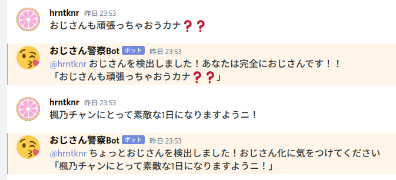

# ojipolice

## なんだこれは
Discordでおじさんな発言をしたときに警告するBot
[招待リンク](https://discord.com/api/oauth2/authorize?client_id=712899313432395817&permissions=67584&scope=bot)



> inspired by [https://github.com/greymd/ojichat](https://github.com/greymd/ojichat)

## 開発環境

```bash
$ go version
go version go1.14.2 linux/amd64
```

## 使い方
```sh
TOKEN={discord bot token} go run *.go
```

### docker版
`.env` ファイルを作成
```
TOKEN={discord bot token}
```

```sh
docker-compose up
```

## Status
[](https://top.gg/bot/712899313432395817)
